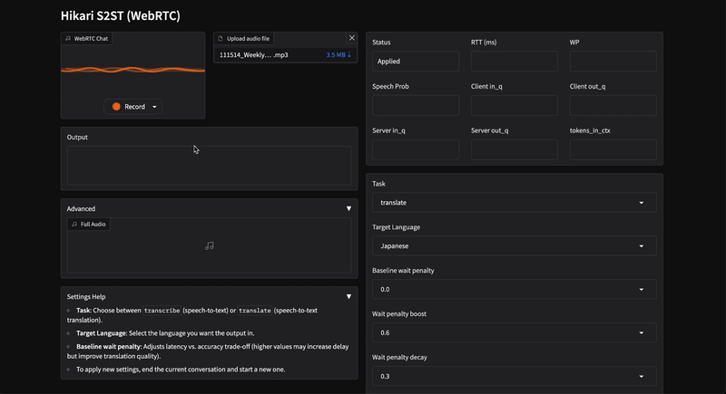

# Hikari: Simultaneous Speech-to-Text Translation

🇬🇧→🇯🇵, 🇬🇧→🇷🇺, 🇬🇧→🇩🇪 and streaming ASR

Hikari is a streaming speech-to-text translation system built on a custom Whisper variant with a fully causal encoder. It uses WebRTC for real-time browser-based interaction. Hikari currently supports English-Japanese, English-Russian and English-German language pairs as well as streaming ASR in English.



## Quick Start

### 1. Install

You'll need to install the repo on a remote machine to run the model server and on your local machine to run the demo client

On both machines, create a clean environment:

```bash
uv venv .venv --python=3.10 && source .venv/bin/activate
```

On the server machine:

```bash
uv pip install torch==2.8.0 torchcodec==0.7.0 torchaudio==2.8.0 torchvision==0.23.0 --index-url https://download.pytorch.org/whl/cu126

# and then

# before the public release
uv pip install "hikari @ git+ssh://git@github.com/sbintuitions/hikari" 

# after the public release
uv pip install "hikari @ git+https://github.com/sbintuitions/hikari"
```

> 💁‍♂️ If you want to install Hikari for development
>
>```bash
>git clone https://github.com/sbintuitions/hikari.git
>cd hikari
>uv pip install torch==2.8.0 torchcodec==0.7.0 torchaudio==2.8.0 torchvision==0.23.0 --index-url https://download.pytorch.org/whl/cu126
>uv pip install -e ".[dev]"
>```


On the client:

```bash
# before the public release
uv pip install "hikari @ git+ssh://git@github.com/sbintuitions/hikari" 

# after the public release
uv pip install "hikari @ git+https://github.com/sbintuitions/hikari"
```

### 2. Start the server (GPU machine)

```bash
hikari-server \
    --port 4440 \
    --checkpoint sbintuitions/hikari-medium \
    --device cuda:0
```

The `--checkpoint` accepts a HuggingFace Hub ID (downloaded automatically) or a local path. The server loads the model, captures CUDA graphs for the encoder and decoder, then listens for WebSocket connections on the specified port.

### 3. Start the client

For now (becuase of the sctrict HPC security policies) the client must be run on your _local_ machine. In the future, the client app will be hosted in the cloud and users will connect to it from their (local) browser. 

```bash
hikari-client \
    --server-port 4440 \
    --app-port 5666 \
    --chunk-ms 80
```

Open `http://localhost:5666` in your browser.

### 4. SSH tunnel (if server is remote)

If the server runs on a remote GPU machine, create an SSH tunnel so the client can reach it:

```bash
ssh -L 4440:localhost:4440 <GPU_HOST>
```

## Requirements

- **Python** >= 3.10
- **PyTorch** >= 2.8.0 with CUDA (server only)
- **CUDA GPU** for the server (tested on A100, H100)
- The client runs on CPU (macOS, Linux, Windows)

## Supported tasks

| Task | Description |
|------|-------------|
| `transcribe` | Simultaneous speech-to-text (English) |
| `translate`  | Simultaneous speech-to-text translation (EN→JA, EN→DE, EN→RU, JA→EN) |

Tasks and parameters can be changed at runtime through the Gradio UI.

## Architecture

```
Browser (mic) ──WebRTC──▶ Gradio Client ──WebSocket──▶ Server
                                                         │
                                                Causal Whisper Encoder
                                                         │
                                                    Whisper Decoder
                                                         │
◀────────────────────────────────────────────────────── text
```

## Acknowledgements

This code was inspired by OpenAI's [Whisper](https://huggingface.co/openai/whisper-medium) and reuses code components from Kyutai's [Moshi](https://github.com/kyutai-labs/moshi).

## Citation

```
@misc{koshkin2026streamingtranslationtranscriptionspeechtotext,
      title={Streaming Translation and Transcription Through Speech-to-Text Causal Alignment}, 
      author={Roman Koshkin and Jeon Haesung and Lianbo Liu and Hao Shi and Mengjie Zhao and Yusuke Fujita and Yui Sudo},
      year={2026},
      eprint={2603.11578},
      archivePrefix={arXiv},
      primaryClass={cs.CL},
      url={https://arxiv.org/abs/2603.11578}, 
}
```
